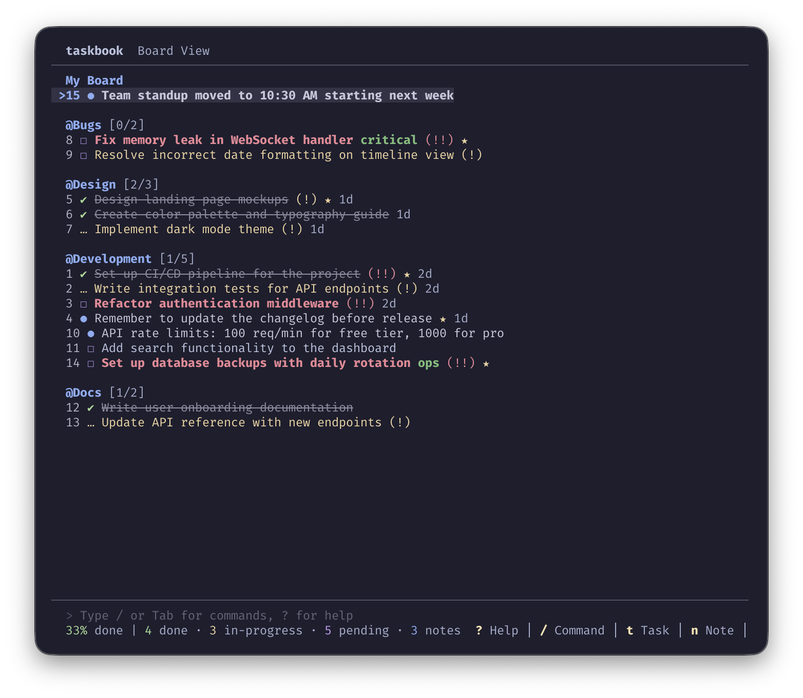
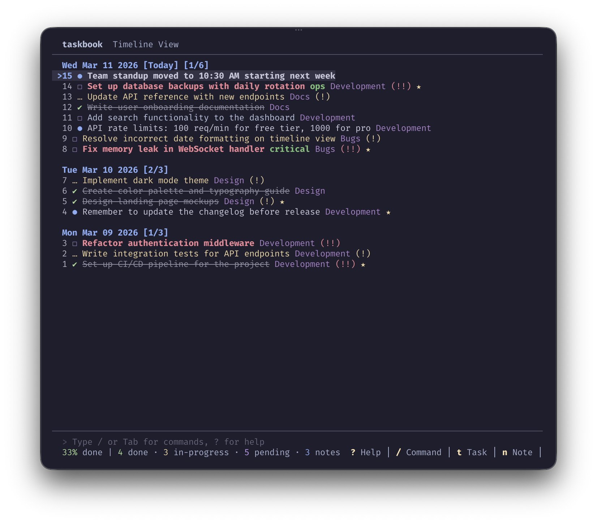
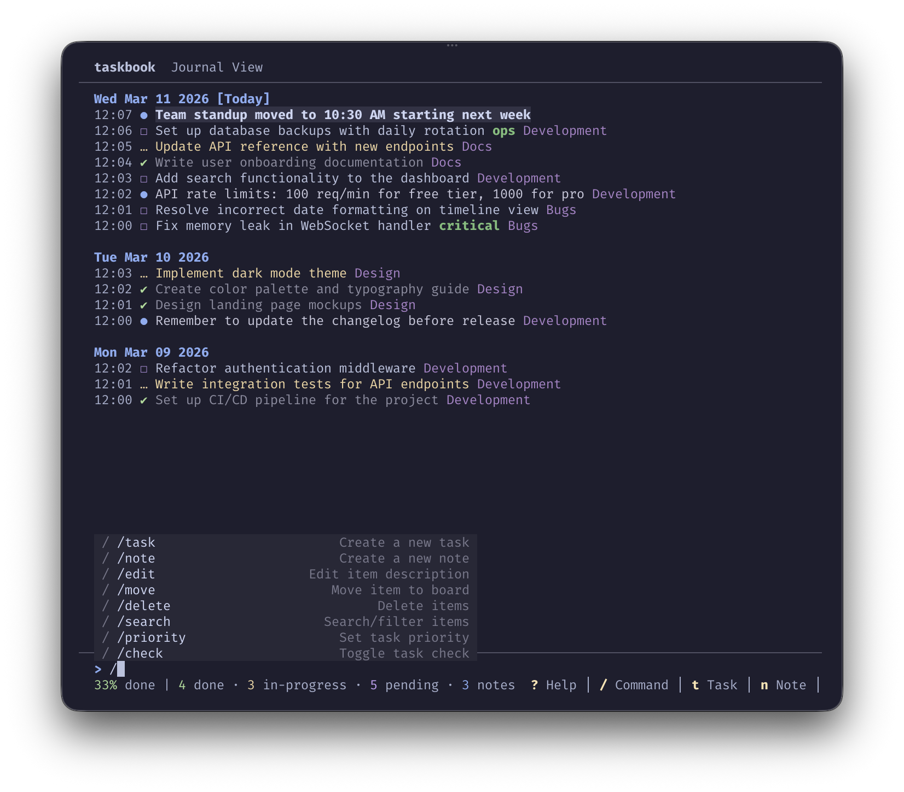
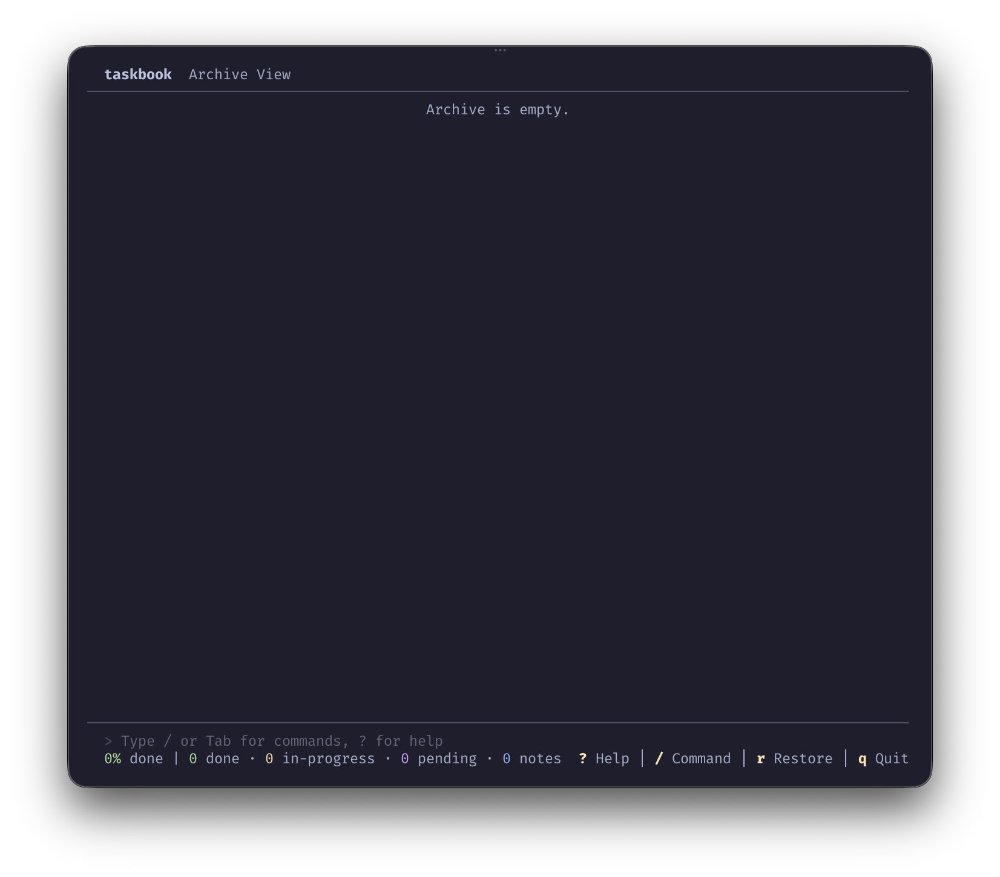

# readme-tabs-experiment

> Exploring every technique to create "tab-like" content in a GitHub README.

GitHub's renderer strips `<style>` tags, all `style=` attributes, `<script>`, `<input>`, `<iframe>`, and `<foreignObject>` inside SVGs.
That rules out the CSS checkbox/radio-button tab hack **on github.com**.

**[→ Live interactive demo on GitHub Pages](https://tobiashochguertel.github.io/readme-tabs-experiment)**

---

## ① `<details>` / `<summary>` — Collapsible Accordion ✅

Best for **code blocks**: compact by default, fully copyable when expanded.


<details>
<summary>🐍 Python</summary>

```python
# Fibonacci sequence
def fibonacci(n: int) -> list[int]:
    a, b = 0, 1
    result = []
    while a < n:
        result.append(a)
        a, b = b, a + b
    return result

print(fibonacci(100))
# [0, 1, 1, 2, 3, 5, 8, 13, 21, 34, 55, 89]
```

</details>


<details>
<summary>🟨 JavaScript</summary>

```javascript
// Fibonacci sequence
function fibonacci(n) {
  const result = [];
  let [a, b] = [0, 1];
  while (a < n) {
    result.push(a);
    [a, b] = [b, a + b];
  }
  return result;
}

console.log(fibonacci(100));
// [0, 1, 1, 2, 3, 5, 8, 13, 21, 34, 55, 89]
```

</details>


<details>
<summary>🐹 Go</summary>

```go
package main

import "fmt"

func fibonacci(n int) []int {
	result := []int{}
	a, b := 0, 1
	for a < n {
		result = append(result, a)
		a, b = b, a+b
	}
	return result
}

func main() {
	fmt.Println(fibonacci(100))
	// [0 1 1 2 3 5 8 13 21 34 55 89]
}
```

</details>


<details>
<summary>🦀 Rust</summary>

```rust
// Fibonacci sequence
fn fibonacci(n: u64) -> Vec<u64> {
    let mut result = Vec::new();
    let (mut a, mut b) = (0u64, 1u64);
    while a < n {
        result.push(a);
        (a, b) = (b, a + b);
    }
    result
}

fn main() {
    println!("{:?}", fibonacci(100));
    // [0, 1, 1, 2, 3, 5, 8, 13, 21, 34, 55, 89]
}
```

</details>


---

## ② HTML `<table>` — Side-by-Side Gallery ✅

Best for **images**: shows them side-by-side with descriptions.

`` `width` and `height` attributes are allowed by GitHub.


<table>
<tr>
  <th>Board View</th>
  <th>Timeline</th>
  <th>Journal</th>
  <th>Commands</th>
  <th>Help</th>
  <th>Archive</th>
</tr>
<tr>
  <td></td>
  <td></td>
  <td></td>
  <td></td>
  <td></td>
  <td></td>
</tr>
<tr>
  <td>Organize tasks and notes into boards with priority levels and progress tracking.</td>
  <td>View all items chronologically, grouped by date.</td>
  <td>A detailed journal of all activity with timestamps.</td>
  <td>Access commands directly from the TUI with `/` or Tab.</td>
  <td>Full keyboard shortcut reference available with `?`.</td>
  <td>Browse and restore deleted items.</td>
</tr>
</table>


> **Tip:** Use `width` on `` to keep columns balanced regardless of original resolution.


---

## ③ Animated SVG — Auto-Cycling Visual Tabs ✅

Pure SVG + CSS `@keyframes`. Cycles through panels automatically every ~4 s.
Content is **not copy-pasteable** (rendered as an image), but great for visual demos.


> GitHub strips `<foreignObject>` from SVGs, so content must be expressed as
> native SVG elements (`<text>`, `<rect>`, etc.) — no HTML, no copy-paste.


---

## ④ Interactive Tabs — GitHub Pages ✅

On GitHub Pages the full browser DOM is available, so **CSS radio-button tabs** and **JavaScript** both work.

| Feature | README (github.com) | GitHub Pages |
|---|---|---|
| `<details>` accordion | ✅ | ✅ |
| HTML `<table>` side-by-side | ✅ | ✅ |
| Animated SVG (auto-cycle) | ✅ | ✅ |
| CSS-only interactive tabs | ❌ | ✅ |
| JS-powered tabs | ❌ | ✅ |
| SVG `<foreignObject>` | ❌ stripped | ✅ |

**[→ Open interactive demo](https://tobiashochguertel.github.io/readme-tabs-experiment)**
**[→ Open interactive SVG directly](https://tobiashochguertel.github.io/readme-tabs-experiment/interactive-tabs.svg)**

---

## Summary

| Technique | Works on github.com? | Interactive? | Copy-paste? |
|---|---|---|---|
| `<details>/<summary>` | ✅ | Click to expand | ✅ |
| HTML `<table>` | ✅ | — | ✅ |
| Animated SVG | ✅ | Auto-cycle only | ❌ (image) |
| CSS radio-button tabs | ❌ | — | — |
| JS tabs | ❌ | — | — |
| GitHub Pages (HTML/JS) | — | ✅ fully interactive | ✅ |

**Recommendation:** Use `<details>` for code blocks and `<table>` for images on github.com.
For a full interactive experience, host on GitHub Pages.

[→ Live demo](https://tobiashochguertel.github.io/readme-tabs-experiment)
