# readme-tabs-experiment

> Exploring every technique to create "tab-like" content in a GitHub README.

GitHub's renderer strips `<style>` tags, all inline `style=` attributes, `<script>`, `<input>`, `<iframe>`, and `<foreignObject>` in SVGs.  
That rules out the CSS checkbox/radio-button tab hack entirely.

Here are the **four real options** — from most to least useful:

---

## ① `<details>` / `<summary>` — Collapsible Accordion ✅

The most practical approach. Keeps the README short; readers expand only what they care about. Code inside is still **copyable**.

<details>
<summary>🐍 Python</summary>

```python
# Fibonacci sequence
def fibonacci(n: int) -> list[int]:
    a, b = 0, 1
    result = []
    while a < n:
        result.append(a)
        a, b = b, a + b
    return result

print(fibonacci(100))
# [0, 1, 1, 2, 3, 5, 8, 13, 21, 34, 55, 89]
```

</details>

<details>
<summary>🟨 JavaScript</summary>

```js
// Fibonacci sequence
function fibonacci(n) {
  const result = [];
  let [a, b] = [0, 1];
  while (a < n) {
    result.push(a);
    [a, b] = [b, a + b];
  }
  return result;
}
// fibonacci(100) → [0, 1, 1, 2, 3, 5, 8, 13, 21, 34, 55, 89]
```

</details>

<details>
<summary>🐹 Go</summary>

```go
package main

func fibonacci(n int) []int {
    result := []int{}
    a, b := 0, 1
    for a < n {
        result = append(result, a)
        a, b = b, a+b
    }
    return result
}
```

</details>

---

## ② HTML `<table>` — Side-by-Side Images / Code ✅

GitHub **does** render basic HTML tables. Useful for images or short snippets side-by-side.

<table>
<tr>
<th>Light Theme</th>
<th>Dark Theme</th>
</tr>
<tr>
<td>

```python
# light-mode snippet
def greet(name):
    print(f"Hello, {name}!")
```

</td>
<td>

```python
# dark-mode snippet
def greet(name):
    print(f"Hello, {name}!")
```

</td>
</tr>
</table>

> **Tip:** `width` and `height` attributes on `` are allowed, making it easy to control thumbnail size in table cells.

---

## ③ Animated SVG — Auto-Cycling Visual Tabs ✅ (read-only, not interactive)

Pure SVG + CSS `@keyframes`. Cycles through panels automatically every ~4 s.  
Content is **not copy-pasteable** (it's rendered as an image), but it looks great for visual demos, screenshots, or architecture diagrams.



> GitHub strips `<foreignObject>` from SVGs, so the content must be expressed as native SVG elements (`<text>`, `<rect>`, etc.). No HTML or copy-paste.

---

## ④ CSS / JS Tabs — ❌ Does Not Work on github.com

The standard CSS-only tab trick uses radio buttons + `:checked` sibling selectors:

```html
<!-- This would work on a normal webpage, but GitHub strips <style> entirely -->
<style>
  input[type=radio] { display:none }
  #tab1:checked ~ .panels .panel-1 { display:block }
</style>
<input type="radio" id="tab1" name="tabs" checked>
<label for="tab1">Tab 1</label>
```

GitHub's sanitizer removes:
- `<style>` blocks
- All `style="…"` inline attributes  
- `<input>` / `<label>` form elements  
- `class` and `id` attributes  
- `<script>` tags

So **no CSS-only tabs, no JS tabs** — period.

---

## Summary

| Technique | Works? | Interactive? | Copy-paste? |
|---|---|---|---|
| `<details>/<summary>` | ✅ | Click to expand | ✅ |
| HTML `<table>` | ✅ | — | ✅ |
| Animated SVG | ✅ | Auto-cycle only | ❌ (image) |
| CSS radio-button tabs | ❌ | — | — |
| JS tabs | ❌ | — | — |
| SVG `<foreignObject>` | ❌ stripped | — | — |

**Recommendation:** Use `<details>` for code blocks (compact + copyable) and `<table>` for images/screenshots side-by-side. Use the animated SVG trick for purely visual "hero" demos where interaction isn't needed.
